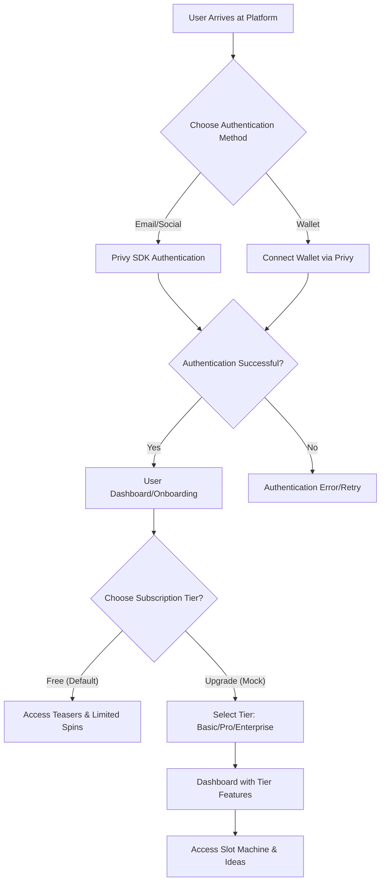
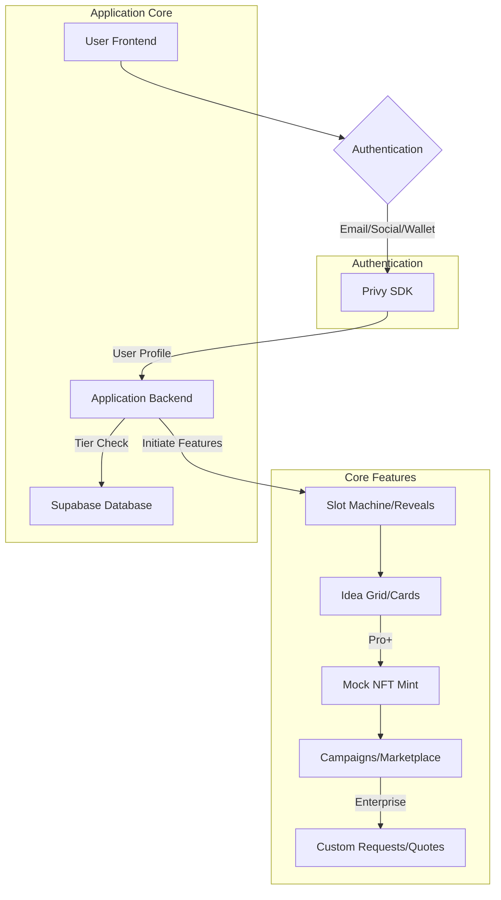

# Updated Documentation for Ideaspire

Below, I've updated the provided documents to reflect the changes discussed in our conversation. The updates align the app with the "Ideaspire" name and core features: daily Reddit-based idea generation, gamified slot machine, tiered subscriptions (mocked initially), pay-per-reveal (mocked), NFT minting (mocked in DB), fundraising campaigns, developer matching, anti-copying mechanisms, and Privy authentication. I've removed or adapted blockchain-specific elements (e.g., Solana, BrainSpark tokens, Jupiter/Moonpay onramp) since our plan uses database mocks for NFTs and no real crypto/payments until Sprint 8. User flows now match our mocked tiers and flows. Technical architecture and implementation plan focus on Next.js, Supabase, Privy, and incremental sprints.

The documents are presented as complete, updated versions in Markdown format.

---

<DOCUMENT filename="README.md">
# Ideaspire Business Ideas Generator

A Next.js web application that generates 10 creative business ideas each day based on trending Reddit topics where users express needs for tools or services. Ideas are generated using the Gemini API and presented in a responsive grid layout with interactive idea cards, gamified discovery via a slot machine, and monetization through tiered subscriptions.

## Features

- Daily generation of 10 creative business ideas from Reddit trends
- Gamified slot machine for idea discovery (spins reveal teasers)
- Tiered access: Free (teasers), Basic (spins + reveals), Pro (unlimited reveals + ownership), Enterprise (custom development)
- Responsive grid layout with interactive idea cards
- Category filtering and search functionality
- Copy ideas to clipboard with one click
- Expandable idea cards with detailed prompts
- Mock NFT minting for idea ownership (database-based)
- Fundraising campaigns for owned ideas
- Developer matching with interest signals and access fees
- Anti-copying mechanisms (watermarks, exclusivity periods, duplicate checks)
- Responsive design for all devices
- Data persistence with Supabase
- AI-powered research using Gemini API
- Reddit community analysis for real user needs
- Duplicate prevention with similarity checking
- Fine-tune similarity thresholds to match your requirements

## Similarity Checking

The application includes a sophisticated similarity checking system to prevent duplicate entries. This system:

- Calculates similarity between new and existing ideas using Jaccard similarity coefficient
- Compares both title and description fields with configurable weights
- Allows fine-tuning of the similarity threshold
- Provides a test endpoint to analyze existing data
- Includes functionality to remove existing duplicates from the database
- Includes both API and UI interfaces for testing different thresholds

## Technology Stack

- **Frontend**: Next.js (JavaScript)
- **Backend**: Next.js API Routes
- **Database**: Supabase (PostgreSQL)
- **AI/Research**: Google Gemini API
- **Authentication**: Privy SDK
- **Deployment**: Vercel
- **Styling**: CSS3 with animations

## Project Structure

```
Ideaspire/
├── components/          # React components (e.g., SlotMachine, IdeaCard)
├── pages/              # Next.js pages and API routes (e.g., dashboard, marketplace)
├── lib/                # Database and API clients (e.g., supabaseClient)
├── styles/             # CSS stylesheets
├── public/             # Static assets
└── utils/              # Utility functions (e.g., similarityCheck)
```

## Getting Started

### Prerequisites

1. Node.js (v14 or higher)
2. Supabase account
3. Google Gemini API key
4. GitHub account (for deployment)

### Setup Instructions

1. **Clone the repository**

   ```bash
   git clone <repository-url>
   cd Ideaspire
   ```

2. **Install dependencies**

   ```bash
   npm install
   ```

3. **Set up environment variables**
   Create a `.env.local` file in the root directory:

   ```env
   NEXT_PUBLIC_SUPABASE_URL=your_supabase_url
   NEXT_PUBLIC_SUPABASE_ANON_KEY=your_supabase_anon_key
   GEMINI_API_KEY=your_gemini_api_key
   PRIVY_APP_ID=your_privy_app_id
   ```

4. **Set up Supabase**

   - Create a new Supabase project
   - Run the database schema from the migration scripts (includes business_ideas, categories, users, subscriptions, etc.)
   - Update environment variables with your Supabase credentials

5. **Run the development server**

   ```bash
   npm run dev
   ```

6. **Open the application**
   Visit `http://localhost:3000` in your browser

## Deployment

This application is optimized for deployment on Vercel:

1. Push your code to a GitHub repository
2. Connect your repository to Vercel
3. Add environment variables in Vercel project settings:
   - Supabase credentials
   - Gemini API key
   - Privy app ID
4. Deploy!

## Database Schema

The application uses several tables in Supabase:

1. `business_ideas` - Stores the generated business ideas
2. `categories` - Optional table for categorizing ideas
3. `users` - User profiles (linked to Privy)
4. `subscriptions` - Mock/real subscription tiers
5. `user_interactions` - Likes, reveals, spins
6. `nfts` - Mock NFTs for owned ideas
7. `campaigns` - Fundraising campaigns
8. `developer_interests` - Dev matching
9. `custom_requests` - Enterprise quotes

Refer to the sprint plan for the complete schema.

## API Integration

### Gemini API

The application uses the Gemini API for research and idea generation. The integration is handled server-side to protect the API key. Gemini analyzes Reddit data to generate business ideas.

### Privy SDK

Privy handles authentication (wallet/email) and user profiles, replacing session-based storage.

### Supabase

Supabase is used for data storage and retrieval. The client is initialized in `lib/supabaseClient.js`.

## UI Components

### Idea Grid

The main display component that presents business ideas in a responsive grid layout. Features include:

- Responsive grid that adapts to screen size (1-4 columns)
- Category filtering and search functionality
- Lazy loading for performance optimization
- Smooth animations and transitions

### Idea Cards

Individual card components representing each business idea with:

- Title and detailed prompt display
- Category badges with color coding
- Expandable content areas
- Copy to clipboard functionality with visual feedback
- Mobile-optimized touch targets
- Reveal and mint buttons (tier-dependent)

### Slot Machine

Gamified component for spinning to discover idea teasers.

## Contributing

1. Fork the repository
2. Create a feature branch
3. Commit your changes
4. Push to the branch
5. Create a pull request

## License

This project is licensed under the MIT License - see the LICENSE file for details.

## Acknowledgments

- Google Gemini API for AI-powered idea generation
- Supabase for backend infrastructure
- Next.js for the React framework
- Vercel for deployment platform
- Privy for authentication
  </DOCUMENT>

<DOCUMENT filename="user-flows.md">
# User Flows for Ideaspire

## 1. New User Onboarding Flow

This flow outlines the steps a new user takes to authenticate with Privy, explore tiers, and access features.



### Steps:

1.  **User Arrives at Platform**: A new user lands on the Ideaspire application.
2.  **Choose Authentication Method**: The user is presented with options to authenticate via Privy:
    - **Email/Social**: Sign up/log in using email or social accounts (e.g., Google).
    - **Wallet**: Connect a wallet for auth.
3.  **Authentication Successful?**: The system verifies the authentication.
    - If successful, the user proceeds to the dashboard/onboarding.
    - If unsuccessful, an error message is displayed, and the user can retry.
4.  **User Dashboard/Onboarding**: The user is welcomed to the platform (default Free tier).
5.  **Choose Subscription Tier?**: The user is prompted to explore or upgrade tiers (mocked initially).
    - Free: Access teasers and limited spins.
    - Basic/Pro/Enterprise: Unlock reveals, ownership, etc.
6.  **Access Slot Machine & Ideas**: With tier set, the user can spin for ideas, reveal, mint (mock NFT), etc.

## 2. Existing User Authentication Flow

This flow describes how an existing user authenticates via Privy to access their tier and features.

```mermaid
graph TD
    A[Existing User Arrives at Platform] --> B[Click "Login"];
    B --> C[Privy Authentication Modal];
    C --> D{Select Method (Email/Social/Wallet)};
    D --> E[Privy Prompts for Approval];
    E -- Approve --> F[Authenticated];
    E -- Reject --> G[Rejected/Retry];
    F --> H[Load Tier & Dashboard];
```

### Steps:

1.  **Existing User Arrives at Platform**: An existing user visits the Ideaspire application.
2.  **Click "Login"**: The user clicks on the "Login" button (typically in the header).
3.  **Privy Authentication Modal**: A modal appears for auth methods.
4.  **Select Method**: The user selects email/social or wallet.
5.  **Privy Prompts for Approval**: Privy handles verification.
6.  **Authenticated**:
    - If approved, load user's tier and dashboard.
    - If rejected, retry.
7.  **Load Tier & Dashboard**: Access features based on subscription (e.g., spins, reveals).
    </DOCUMENT>

<DOCUMENT filename="technical-architecture-onramp-auth.md">
# Technical Architecture for Authentication and Features

## 1. Overview

This document outlines the technical architecture for integrating Privy SDK for authentication and the core app features (tiers, slot machine, mocks for NFTs/campaigns) within the Ideaspire application. The goal is to provide a seamless experience for users to authenticate, access tiers, and interact with ideas.

## 2. Key Integrations

### 2.1. Privy SDK for Authentication

- **Purpose**: Provide flexible email/social and wallet authentication, with user profiles linked to Supabase.
- **Integration Point**: Frontend (client-side) for user interaction, backend for session management.
- **Flow**:
  1.  User initiates login from the application UI.
  2.  Privy handles auth and provides user ID/wallet.
  3.  Backend syncs user data to Supabase.
- **Considerations**:
  - **API Keys**: Securely manage Privy app ID.
  - **Error Handling**: Graceful handling of failed logins.
  - **Data Sync**: Link Privy users to Supabase `users` table.

### 2.2. Subscription Tiers and Features

- **Purpose**: Gate features by tiers (Free/Basic/Pro/Enterprise), mocked in DB.
- **Integration Point**: Frontend for UI, backend for enforcement.
- **Flow**:
  1.  User selects/mock-upgrades tier.
  2.  Backend updates `subscriptions` table.
  3.  Features (e.g., reveals) check tier via API.
- **Considerations**:
  - **Mocking**: Use DB flags for tiers until payments.
  - **Enforcement**: Conditional rendering based on tier.

### 2.3. Mock NFT and Campaign Features

- **Purpose**: Simulate ownership and fundraising without blockchain.
- **Integration Point**: Backend for DB operations, frontend for UI.
- **Flow**:
  1.  Pro user mints idea (insert to `nfts`).
  2.  Create campaign from NFT (insert to `campaigns`).
  3.  Mock pledges update DB.
- **Considerations**:
  - **Anti-Copying**: Watermarks in metadata, duplicate checks.

## 3. System Architecture Diagram



### Components:

- **User Frontend**: The Next.js application where users interact with the UI.
- **Authentication**: Entry point using Privy for email/social/wallet.
- **Privy SDK**: Handles auth and provides user data.
- **Application Backend**: Next.js API routes for:
  - Tier management.
  - Idea generation/reveals.
  - Mock NFT/campaign operations.
  - Interacting with Supabase.
- **Supabase Database**: Stores all data (ideas, users, subscriptions, etc.).
- **Slot Machine/Reveals**: Gamified discovery.
- **Idea Grid/Cards**: Display and interaction.
- **Mock NFT Mint**: DB-based ownership.
- **Campaigns/Marketplace**: Fundraising simulation.
- **Custom Requests/Quotes**: Enterprise tools.

## 4. Data Flow

1.  **User Authentication**:
    - Auth via Privy, sync to Supabase `users`.
2.  **Tier Access**:
    - Mock upgrade updates `subscriptions`.
    - Features query tier for access.
3.  **Idea Interactions**:
    - Spin/reveal inserts to `user_interactions`.
    - Mint/campaign uses `nfts`/`campaigns`.
4.  **Data Storage**:
    - All in Supabase, linked by user_id.

## 5. Security Considerations

- **API Key Management**: Environment variables for Privy/Supabase.
- **Input Validation**: Validate all requests.
- **Rate Limiting**: On API endpoints.
- **Access Control**: Tier-based checks.
  </DOCUMENT>

<DOCUMENT filename="implementation-plan-onramp-auth.md">
# Implementation Plan for Authentication and Features

## 1. Introduction

This document details the step-by-step implementation plan for integrating Privy SDK for authentication and the core features (tiers, slot machine, mocks) into the Ideaspire application. Follow the sprint structure from our plan.

## 2. Privy SDK Implementation

### 2.1. Frontend Integration

- **Task**: Initialize Privy SDK and configure providers.
  - **Sub-tasks**:
    - Install Privy SDK.
    - Wrap app with `PrivyProvider`.
    - Configure email/social/wallet methods.
- **Task**: Implement auth UI components.
  - **Sub-tasks**:
    - Integrate `Login`/`Logout`.
    - Handle state changes (e.g., show dashboard on login).
- **Task**: Access user data.
  - **Sub-tasks**:
    - Use hooks for user ID/wallet.
    - Display profile in UI.

### 2.2. Backend Integration

- **Task**: Manage sessions.
  - **Sub-tasks**:
    - Validate Privy tokens in API routes.
- **Task**: Sync with Supabase.
  - **Sub-tasks**:
    - On login, insert/update `users` table.

## 3. Subscription Tiers Implementation

- **Task**: Add mock tiers (Sprint 2).
  - **Sub-tasks**:
    - Create `subscriptions` table.
    - API endpoints for mock upgrades.
    - UI page with tier cards/buttons.
- **Task**: Enforce tiers.
  - **Sub-tasks**:
    - Conditional logic in components (e.g., blur for Free).

## 4. Core Features Implementation

### 4.1. Slot Machine and Reveals (Sprint 3)

- **Task**: Build slot machine.
  - **Sub-tasks**:
    - Component with animations.
    - Limit spins for Free.
- **Task**: Handle reveals.
  - **Sub-tasks**:
    - Mock insert to `user_interactions` (type='reveal').

### 4.2. Mock NFT Minting (Sprint 4)

- **Task**: Add mint logic.
  - **Sub-tasks**:
    - Create `nfts` table.
    - API endpoint for insert.
    - UI button on ideas.

### 4.3. Campaigns and Matching (Sprints 5-6)

- **Task**: Build campaigns.
  - **Sub-tasks**:
    - `campaigns` table.
    - Builder form and marketplace.
- **Task**: Dev matching.
  - **Sub-tasks**:
    - `developer_interests` table.
    - Interest/approve endpoints.

### 4.4. Enterprise Features (Sprint 7)

- **Task**: Custom tools.
  - **Sub-tasks**:
    - `custom_requests` table.
    - Filters and quote generator.

## 5. Security Implementation Details

- **Environment Variables**: Load from `.env.local`.
- **Validation**: Use Zod for schemas.
- **Rate Limiting**: Custom middleware.
- **Error Logging**: Console/Sentry.

## 6. Testing Strategy

- **Unit Tests**: Jest for components/functions.
- **Integration Tests**: Cypress for flows.
- **Manual Testing**: All tiers/flows.

## 7. Deployment Considerations

- **Vercel**: Env vars for Privy/Supabase.
- **CI/CD**: GitHub Actions.
- **Monitoring**: Vercel analytics.
  </DOCUMENT>
