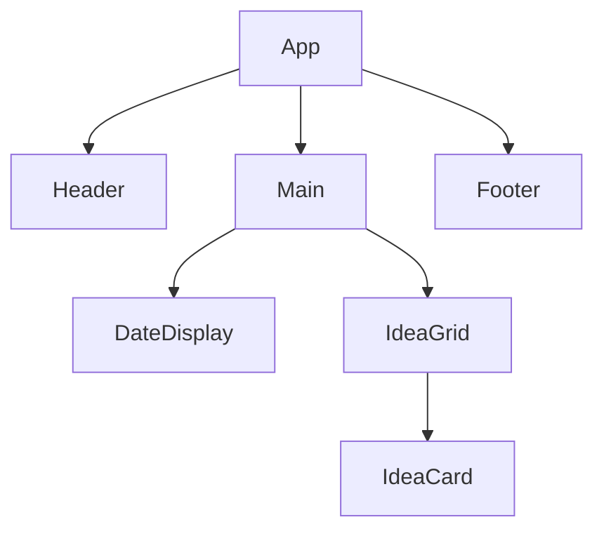
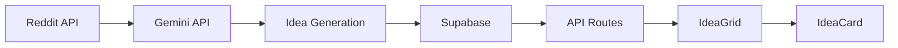

# Component Design Specification

## Overview

This document details the design and implementation of the UI components for the SpinToWin Business Ideas Generator application.

## Component Hierarchy



## Main Components

### 1. IdeaGrid Component

#### Purpose

The central display component that presents business ideas in a responsive grid layout.

#### Props

```javascript
{
  ideas: Array<{id, title, description, prompt, category}>,
  loading: Boolean,
  onIdeaClick: Function
}
```

#### State

```javascript
{
  selectedIdea: Object,
  gridLayout: String // 'list', 'grid', 'masonry'
}
```

#### Key Features

1. **Responsive Grid Layout**: Adapts from 1 column on mobile to multiple columns on desktop
2. **Category Filtering**: Filter ideas by business category
3. **Sorting Options**: Sort by relevance, date, or alphabetical
4. **Copy Functionality**: Click to copy idea prompt to clipboard
5. **Pagination**: Handle large numbers of ideas efficiently
6. **Search**: Filter ideas by keywords

#### Implementation Details

- Uses CSS Grid with auto-fit columns
- Implements infinite scroll or pagination
- Responsive breakpoints for optimal layout
- Lazy loading of idea cards

### 2. IdeaCard Component

#### Purpose

Individual card components that display each business idea with detailed information.

#### Props

```javascript
{
  idea: {id, title, description, prompt, category, date},
  isSelected: Boolean,
  onClick: Function,
  onCopy: Function
}
```

#### State

```javascript
{
  isExpanded: Boolean,
  copyStatus: String // 'idle', 'copying', 'copied'
}
```

#### Key Features

1. **Rich Content Display**: Title, description, and full prompt
2. **Category Badges**: Color-coded category indicators
3. **Copy to Clipboard**: Quick copy functionality with visual feedback
4. **Expand/Collapse**: Show more or less detail
5. **Accessibility**: Full keyboard and screen reader support

#### Implementation Details

- Expandable content area for full prompts
- Smooth copy-to-clipboard animations
- Category color coding
- Mobile-optimized touch targets

### 3. DateDisplay Component

#### Purpose

Displays the current date prominently at the top of the application.

#### Props

```javascript
{
  date: Date;
}
```

#### Key Features

1. **Formatted Date**: Displays in "Your top ideas for {current date}" format
2. **Styling**: Centered, prominent typography
3. **Responsive**: Adapts to different screen sizes
4. **Localization**: Supports different date formats

#### Implementation Details

- Uses Intl.DateTimeFormat for date formatting
- Responsive typography with CSS clamp()
- Animated entrance on page load
- Accessible with proper heading levels

### 4. Header Component

#### Purpose

Contains the application title and date display.

#### Props

```javascript
{
  currentDate: Date;
}
```

#### Key Features

1. **Application Title**: Clear branding
2. **Date Display**: Integration with DateDisplay component
3. **Navigation**: Potential future navigation elements
4. **Responsive**: Adapts to mobile and desktop views

### 5. Footer Component

#### Purpose

Contains additional information and links.

#### Props

```javascript
{
  version: String;
}
```

#### Key Features

1. **Attribution**: Credits for data sources
2. **Links**: Navigation to documentation, GitHub, etc.
3. **Version Info**: Current application version
4. **Legal**: Copyright and licensing information

## Styling Architecture

### CSS Modules Approach

Each component will have its own CSS module file for scoped styling:

```
components/
├── IdeaGrid/
│   ├── IdeaGrid.js
│   └── IdeaGrid.module.css
├── IdeaCard/
│   ├── IdeaCard.js
│   └── IdeaCard.module.css
└── DateDisplay/
    ├── DateDisplay.js
    └── DateDisplay.module.css
```

### Design Tokens

Shared design values for consistency:

```css
:root {
  --primary-color: #4f46e5;
  --secondary-color: #818cf8;
  --background-color: #f8fafc;
  --text-color: #1e293b;
  --accent-color: #f59e0b;
  --success-color: #10b981;
  --font-family: "Inter", sans-serif;
  --border-radius: 8px;
  --transition-speed: 0.3s;
}
```

## Animation System

### Core Animations

1. **Grid Layout Transitions**: Smooth layout changes and filtering
2. **Card Hover Effects**: Elevation and scale transitions
3. **Copy Feedback**: Visual confirmation when copying
4. **Loading States**: Skeleton screens and staggered card appearances
5. **Search/Filter**: Smooth filtering with fade transitions

### Implementation

- CSS animations for simple transitions
- Framer Motion for complex orchestration
- CSS Grid animations for layout changes
- Staggered animations for card loading
- CSS prefers-reduced-motion support

## Responsive Design

### Breakpoints

```css
/* Mobile first approach */
@media (min-width: 640px) {
  /* SM */
}
@media (min-width: 768px) {
  /* MD */
}
@media (min-width: 1024px) {
  /* LG */
}
@media (min-width: 1280px) {
  /* XL */
}
```

### Adaptations

1. **Grid Columns**: 1 column on mobile, 2-4 columns on larger screens
2. **Card Size**: Adapts based on available space and content
3. **Touch Targets**: Larger buttons on mobile for better usability
4. **Typography**: Responsive text sizing using clamp()
5. **Spacing**: Flexible margins and gutters using CSS Grid

## Accessibility Features

### Keyboard Navigation

- Full keyboard operability
- Logical focus order
- Skip links for navigation
- Keyboard shortcuts for common actions

### Screen Reader Support

- Semantic HTML structure
- ARIA labels and roles
- Live regions for dynamic updates
- Proper heading hierarchy

### Visual Considerations

- Sufficient color contrast
- Focus indicators
- Reduced motion options
- Text scaling support

## Performance Considerations

### Rendering Optimization

- Virtualization for large grids with many cards
- Memoization of expensive calculations
- Efficient re-rendering strategies with React.memo
- Lazy loading of idea cards outside viewport
- Image optimization for category icons

### Animation Performance

- CSS transform-based animations for smooth transitions
- Staggered loading animations for card sets
- Debounced scroll events for infinite loading
- Efficient CSS Grid layout transitions
- will-change property for animation targets

## Integration Points

### Data Flow



### Event Handling

1. **Idea Selection**: Click on card to copy or expand
2. **Grid Interactions**: Filter, search, and sort functionality
3. **Copy Actions**: Copy idea prompts to clipboard with feedback
4. **Data Updates**: Polling or real-time idea refresh
5. **User Preferences**: Grid layout and sorting preferences

## Testing Strategy

### Component Testing

- Unit tests for each component
- Snapshot testing for UI consistency
- Interaction testing with React Testing Library
- Accessibility testing with axe

### Integration Testing

- API route testing
- Database integration testing
- End-to-end user flows
- Performance benchmarking

## Future Enhancements

### Planned Features

1. **Category Filtering**: Filter ideas by category
2. **Search Functionality**: Search through all ideas
3. **Favorites System**: Save favorite ideas
4. **Social Sharing**: Share ideas on social media
5. **Dark Mode**: Theme switching capability

### Technical Improvements

1. **WebGL Acceleration**: For more complex 3D visualizations
2. **Progressive Web App**: Offline support and installability
3. **Advanced Analytics**: User behavior tracking
4. **Internationalization**: Multi-language support
5. **Performance Monitoring**: Real-user monitoring integration
