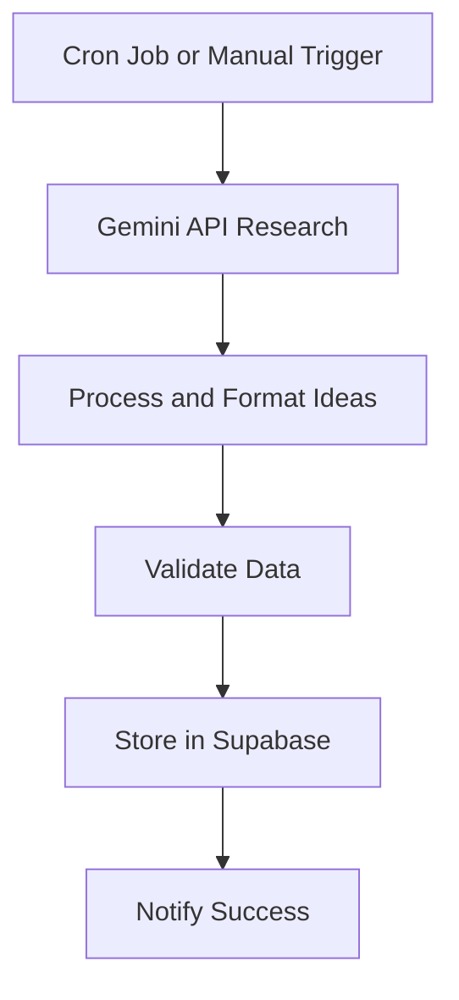
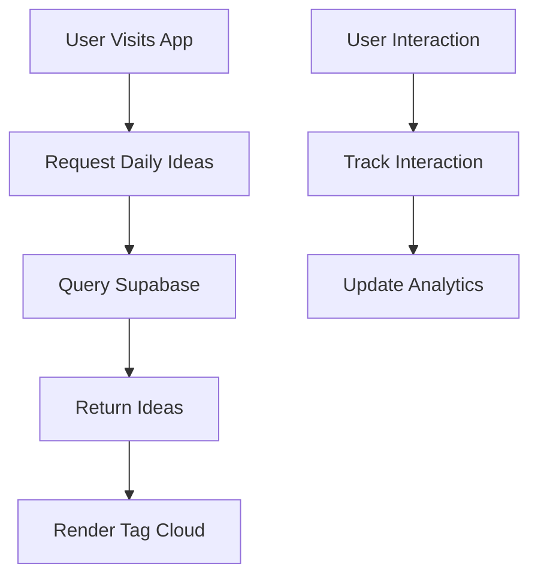

# Data Model Specification

## Overview

This document details the data model for the SpinToWin Business Ideas Generator application, including database schema, API endpoints, and data flow.

## Database Schema

### 1. Business Ideas Table

```sql
CREATE TABLE business_ideas (
  id SERIAL PRIMARY KEY,
  title VARCHAR(255) NOT NULL,
  description TEXT NOT NULL,
  prompt TEXT NOT NULL,
  category VARCHAR(100),
  date DATE NOT NULL,
 relevance_score DECIMAL(3,2) DEFAULT 0.00,
  source VARCHAR(100),
  created_at TIMESTAMP WITH TIME ZONE DEFAULT NOW(),
  updated_at TIMESTAMP WITH TIME ZONE DEFAULT NOW()
);
```

#### Fields Description

- **id**: Unique identifier for each idea
- **title**: Short, catchy title for the idea
- **description**: Detailed explanation of the business idea
- **prompt**: Formatted prompt for AI development
- **category**: Category classification (e.g., "Tech", "E-commerce", "Service")
- **date**: Date for which the idea was generated
- **relevance_score**: Numerical score indicating relevance/popularity
- **source**: Source of inspiration (e.g., "Twitter", "News", "Gemini")
- **created_at**: Timestamp when the record was created
- **updated_at**: Timestamp when the record was last updated

### 2. Categories Table

```sql
CREATE TABLE categories (
  id SERIAL PRIMARY KEY,
  name VARCHAR(100) NOT NULL UNIQUE,
  description TEXT,
  color VARCHAR(7), -- HEX color code
  created_at TIMESTAMP WITH TIME ZONE DEFAULT NOW()
);
```

#### Fields Description

- **id**: Unique identifier for each category
- **name**: Name of the category
- **description**: Description of what ideas belong to this category
- **color**: HEX color code for UI representation
- **created_at**: Timestamp when the record was created

### 3. User Interactions Table (Optional for Future)

```sql
CREATE TABLE user_interactions (
  id SERIAL PRIMARY KEY,
  idea_id INTEGER REFERENCES business_ideas(id),
  interaction_type VARCHAR(50), -- 'copy', 'view', 'favorite', 'share'
  user_id UUID, -- For authenticated users
  session_id VARCHAR(255), -- For anonymous users
  metadata JSONB, -- Additional data about the interaction
  created_at TIMESTAMP WITH TIME ZONE DEFAULT NOW()
);
```

#### Fields Description

- **id**: Unique identifier for each interaction
- **idea_id**: Reference to the business idea
- **interaction_type**: Type of user interaction
- **user_id**: Identifier for authenticated users
- **session_id**: Identifier for anonymous users
- **metadata**: Additional data in JSON format
- **created_at**: Timestamp when the interaction occurred

## Indexes for Performance

```sql
-- Index for fetching ideas by date
CREATE INDEX idx_business_ideas_date ON business_ideas(date);

-- Index for fetching ideas by category
CREATE INDEX idx_business_ideas_category ON business_ideas(category);

-- Index for sorting by relevance
CREATE INDEX idx_business_ideas_relevance ON business_ideas(relevance_score DESC);

-- Index for user interactions
CREATE INDEX idx_user_interactions_idea_id ON user_interactions(idea_id);
CREATE INDEX idx_user_interactions_type ON user_interactions(interaction_type);
```

## API Endpoints

### 1. Get Daily Ideas

```
GET /api/ideas/daily
```

#### Query Parameters

- `date` (optional): Specific date (defaults to current date)
- `limit` (optional): Number of ideas to return (defaults to 10)

#### Response

```json
{
  "date": "2025-09-18",
  "ideas": [
    {
      "id": 1,
      "title": "AI-Powered Recipe Generator",
      "description": "An app that creates personalized recipes based on available ingredients and dietary preferences using AI.",
      "prompt": "Create a business plan for an AI-powered recipe generator app that scans users' pantry items and suggests recipes based on dietary restrictions and preferences.",
      "category": "Tech",
      "relevance_score": 0.85,
      "source": "Gemini"
    }
    // ... 9 more ideas
  ]
}
```

### 2. Generate New Ideas

```
POST /api/ideas/generate
```

#### Request Body

```json
{
  "date": "2025-09-18",
  "force": false // Set to true to regenerate even if ideas exist
}
```

#### Response

```json
{
  "success": true,
  "message": "Ideas generated successfully",
  "count": 10
}
```

### 3. Copy Idea Tracking

```
POST /api/ideas/copy
```

#### Request Body

```json
{
  "idea_id": 1,
  "user_id": "uuid", // Optional
  "session_id": "session-id" // For anonymous users
}
```

#### Response

```json
{
  "success": true,
  "message": "Copy tracked successfully"
}
```

### 4. Get Idea by ID

```
GET /api/ideas/{id}
```

#### Response

```json
{
  "id": 1,
  "title": "AI-Powered Recipe Generator",
  "description": "An app that creates personalized recipes based on available ingredients and dietary preferences using AI.",
  "prompt": "Create a business plan for an AI-powered recipe generator app that scans users' pantry items and suggests recipes based on dietary restrictions and preferences.",
  "category": "Tech",
  "date": "2025-09-18",
  "relevance_score": 0.85,
  "source": "Gemini",
  "created_at": "2025-09-18T10:00:00Z",
  "updated_at": "2025-09-18T10:00:00Z"
}
```

## Data Flow

### 1. Daily Idea Generation Process



### 2. User Request Process



## Data Validation Rules

### Business Ideas Validation

- **title**: Required, max 255 characters
- **description**: Required, max 1000 characters
- **prompt**: Required, max 2000 characters
- **category**: Optional, must exist in categories table if provided
- **date**: Required, must be a valid date
- **relevance_score**: Optional, between 0.00 and 1.00

### Categories Validation

- **name**: Required, unique, max 100 characters
- **description**: Optional, max 500 characters
- **color**: Optional, valid HEX color format

## Sample Data

### Sample Business Ideas

```json
[
  {
    "title": "Vibe Coding Music Generator",
    "description": "An AI-powered app that creates personalized coding playlists based on current task, time of day, and productivity levels.",
    "prompt": "Develop a business plan for a music streaming service specifically designed for developers. The app should analyze the type of code being written and suggest appropriate background music to enhance focus and productivity.",
    "category": "Tech",
    "date": "2025-09-18",
    "relevance_score": 0.92,
    "source": "Gemini"
  },
  {
    "title": "Micro-SaaS Idea Validator",
    "description": "A platform that helps entrepreneurs quickly validate their SaaS ideas through market research and competitor analysis.",
    "prompt": "Create a tool that helps entrepreneurs validate their SaaS business ideas by analyzing market demand, competition, and potential revenue. Include features for survey creation, competitor analysis, and financial projections.",
    "category": "Startup",
    "date": "2025-09-18",
    "relevance_score": 0.88,
    "source": "Twitter"
  }
]
```

### Sample Categories

```json
[
  {
    "name": "Tech",
    "description": "Technology-based business ideas",
    "color": "#4f46e5"
  },
  {
    "name": "Startup",
    "description": "Traditional startup business models",
    "color": "#818cf8"
  },
  {
    "name": "E-commerce",
    "description": "Online retail and marketplace ideas",
    "color": "#60a5fa"
  },
  {
    "name": "Service",
    "description": "Service-based business ideas",
    "color": "#34d399"
  }
]
```

## Security Considerations

### API Security

- Rate limiting to prevent abuse
- Input validation and sanitization
- Authentication for admin endpoints
- HTTPS encryption for all API calls

### Database Security

- Parameterized queries to prevent SQL injection
- Role-based access control
- Regular security audits
- Data encryption for sensitive information

### Data Privacy

- GDPR compliance for user data
- Data retention policies
- User consent for data collection
- Right to deletion implementation

## Performance Optimization

### Database Optimization

- Proper indexing for frequent queries
- Connection pooling
- Query optimization
- Caching strategies

### API Optimization

- Response compression
- Pagination for large datasets
- Efficient data serialization
- CDN for static assets

## Backup and Recovery

### Data Backup Strategy

- Daily automated backups
- Point-in-time recovery
- Cross-region replication
- Backup retention policies

### Disaster Recovery

- Recovery time objectives (RTO)
- Recovery point objectives (RPO)
- Failover procedures
- Regular recovery testing

## Monitoring and Analytics

### Key Metrics

- API response times
- Database query performance
- User engagement metrics
- Error rates and logging

### Monitoring Tools

- Database performance monitoring
- API endpoint monitoring
- User behavior analytics
- Infrastructure health checks
