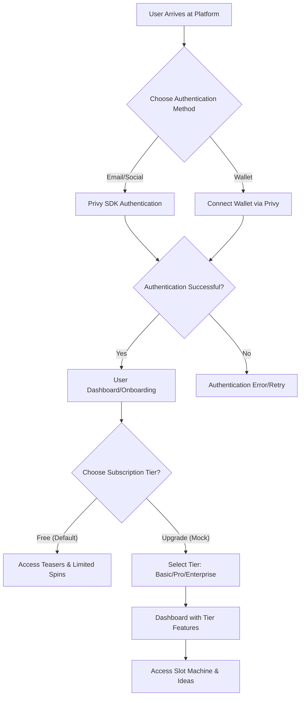
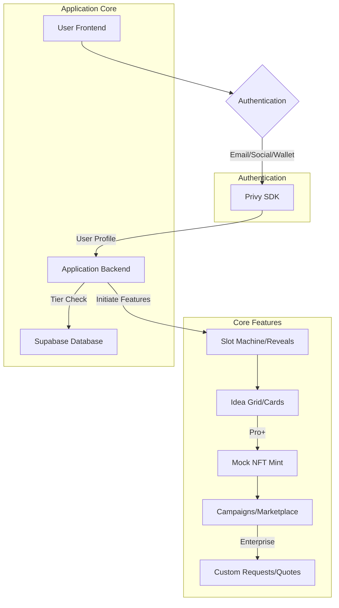

# User Flows for Ideaspire

## 1. New User Onboarding Flow

This flow outlines the steps a new user takes to authenticate with Privy, explore tiers, and access features.



### Steps:

1.  **User Arrives at Platform**: A new user lands on the Ideaspire application.
2.  **Choose Authentication Method**: The user is presented with options to authenticate via Privy:
    - **Email/Social**: Sign up/log in using email or social accounts (e.g., Google).
    - **Wallet**: Connect a wallet for auth.
3.  **Authentication Successful?**: The system verifies the authentication.
    - If successful, the user proceeds to the dashboard/onboarding.
    - If unsuccessful, an error message is displayed, and the user can retry.
4.  **User Dashboard/Onboarding**: The user is welcomed to the platform (default Free tier).
5.  **Choose Subscription Tier?**: The user is prompted to explore or upgrade tiers (mocked initially).
    - Free: Access teasers and limited spins.
    - Basic/Pro/Enterprise: Unlock reveals, ownership, etc.
6.  **Access Slot Machine & Ideas**: With tier set, the user can spin for ideas, reveal, mint (mock NFT), etc.

## 2. Existing User Authentication Flow

This flow describes how an existing user authenticates via Privy to access their tier and features.

```mermaid
graph TD
    A[Existing User Arrives at Platform] --> B[Click "Login"];
    B --> C[Privy Authentication Modal];
    C --> D{Select Method (Email/Social/Wallet)};
    D --> E[Privy Prompts for Approval];
    E -- Approve --> F[Authenticated];
    E -- Reject --> G[Rejected/Retry];
    F --> H[Load Tier & Dashboard];
```

### Steps:

1.  **Existing User Arrives at Platform**: An existing user visits the Ideaspire application.
2.  **Click "Login"**: The user clicks on the "Login" button (typically in the header).
3.  **Privy Authentication Modal**: A modal appears for auth methods.
4.  **Select Method**: The user selects email/social or wallet.
5.  **Privy Prompts for Approval**: Privy handles verification.
6.  **Authenticated**:
    - If approved, load user's tier and dashboard.
    - If rejected, retry.
7.  **Load Tier & Dashboard**: Access features based on subscription (e.g., spins, reveals).
    </DOCUMENT>

<DOCUMENT filename="technical-architecture-onramp-auth.md">
# Technical Architecture for Authentication and Features

## 1. Overview

This document outlines the technical architecture for integrating Privy SDK for authentication and the core app features (tiers, slot machine, mocks for NFTs/campaigns) within the Ideaspire application. The goal is to provide a seamless experience for users to authenticate, access tiers, and interact with ideas.

## 2. Key Integrations

### 2.1. Privy SDK for Authentication

- **Purpose**: Provide flexible email/social and wallet authentication, with user profiles linked to Supabase.
- **Integration Point**: Frontend (client-side) for user interaction, backend for session management.
- **Flow**:
  1.  User initiates login from the application UI.
  2.  Privy handles auth and provides user ID/wallet.
  3.  Backend syncs user data to Supabase.
- **Considerations**:
  - **API Keys**: Securely manage Privy app ID.
  - **Error Handling**: Graceful handling of failed logins.
  - **Data Sync**: Link Privy users to Supabase `users` table.

### 2.2. Subscription Tiers and Features

- **Purpose**: Gate features by tiers (Free/Basic/Pro/Enterprise), mocked in DB.
- **Integration Point**: Frontend for UI, backend for enforcement.
- **Flow**:
  1.  User selects/mock-upgrades tier.
  2.  Backend updates `subscriptions` table.
  3.  Features (e.g., reveals) check tier via API.
- **Considerations**:
  - **Mocking**: Use DB flags for tiers until payments.
  - **Enforcement**: Conditional rendering based on tier.

### 2.3. Mock NFT and Campaign Features

- **Purpose**: Simulate ownership and fundraising without blockchain.
- **Integration Point**: Backend for DB operations, frontend for UI.
- **Flow**:
  1.  Pro user mints idea (insert to `nfts`).
  2.  Create campaign from NFT (insert to `campaigns`).
  3.  Mock pledges update DB.
- **Considerations**:
  - **Anti-Copying**: Watermarks in metadata, duplicate checks.

## 3. System Architecture Diagram



### Components:

- **User Frontend**: The Next.js application where users interact with the UI.
- **Authentication**: Entry point using Privy for email/social/wallet.
- **Privy SDK**: Handles auth and provides user data.
- **Application Backend**: Next.js API routes for:
  - Tier management.
  - Idea generation/reveals.
  - Mock NFT/campaign operations.
  - Interacting with Supabase.
- **Supabase Database**: Stores all data (ideas, users, subscriptions, etc.).
- **Slot Machine/Reveals**: Gamified discovery.
- **Idea Grid/Cards**: Display and interaction.
- **Mock NFT Mint**: DB-based ownership.
- **Campaigns/Marketplace**: Fundraising simulation.
- **Custom Requests/Quotes**: Enterprise tools.

## 4. Data Flow

1.  **User Authentication**:
    - Auth via Privy, sync to Supabase `users`.
2.  **Tier Access**:
    - Mock upgrade updates `subscriptions`.
    - Features query tier for access.
3.  **Idea Interactions**:
    - Spin/reveal inserts to `user_interactions`.
    - Mint/campaign uses `nfts`/`campaigns`.
4.  **Data Storage**:
    - All in Supabase, linked by user_id.

## 5. Security Considerations

- **API Key Management**: Environment variables for Privy/Supabase.
- **Input Validation**: Validate all requests.
- **Rate Limiting**: On API endpoints.
- **Access Control**: Tier-based checks.
