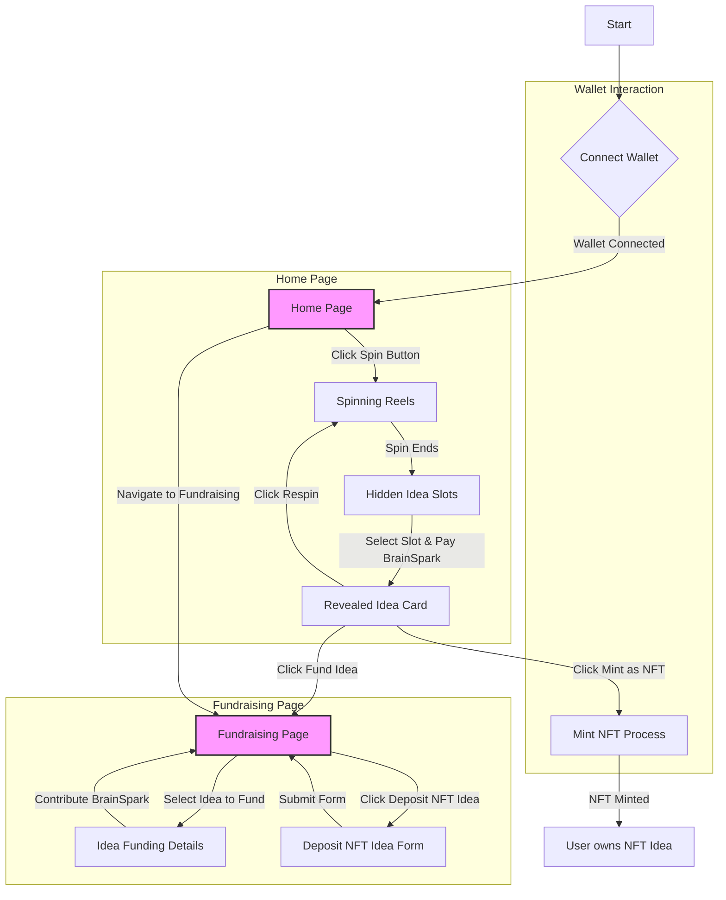

# Spin-to-Win Feature Wireframe (Conceptual)

This Mermaid diagram outlines the main user flows and conceptual layout for the Spin-to-Win application.

## Home Page Elements:

- **Connect Wallet Button**: Prominently displayed, typically in the header.
- **Wallet Address & BrainSpark Balance**: Displayed once a wallet is connected.
- **Spin Button**: Central to the "slot machine" interface.
- **Idea Reels Area**: Visual representation of the spinning reels.
- **Hidden Idea Slots**: After a spin, three masked slots appear. Each has a "Reveal Idea" button with the BrainSpark cost.
- **Revealed Idea Card**: Once an idea is revealed, its title, description, "Mint as NFT" button, and "Fund Idea" button are shown.

## Fundraising Page Elements:

- **List of Ideas**: Displays ideas that users have deposited for fundraising.
- **Idea Card (Fundraising)**: For each listed idea, shows Title, Description, Current Funding, Funding Goal, and a "Contribute" button.
- **Deposit NFT Idea for Funding Button**: Allows users to initiate the process of listing their owned NFT idea for fundraising.

## Wallet Connection Modal:

- Standard UI for connecting to Solana wallets (e.g., Phantom, Solflare).
